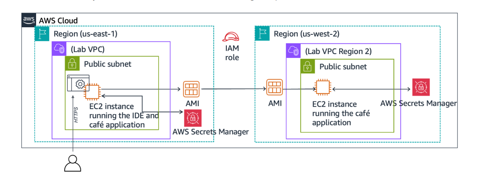
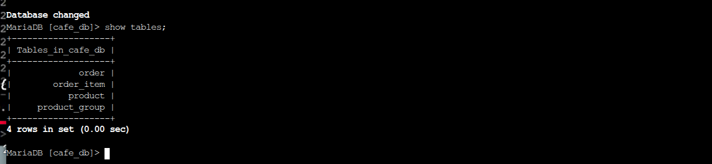
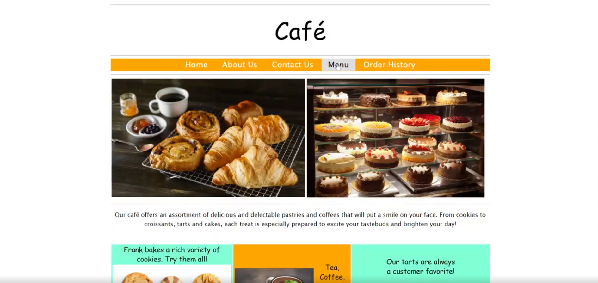

# AWS Dynamic Web Application: High-Availability Café Ordering System

## Evolution: From Static Content to Dynamic Transactions
This project marks the successful migration of the Café's web presence from a simple S3-hosted static site to a **Dynamic 3-Tier Architecture**. The shift was driven by a new business requirement: enabling customers to place online orders and allowing staff to manage them in real-time.

## Project Overview & Objectives
The goal was to build a robust development environment in one region and replicate it as a production environment in another, ensuring high availability and disaster recovery (DR).

**Key Deliverables:**
* Connected and configured a **VS Code IDE** on an EC2 instance.
* Established a **LAMP Stack** (Linux, Apache, MariaDB, PHP) environment.
* Secured application credentials using **AWS Secrets Manager**.
* Implemented a **Cross-Region Deployment** strategy using Custom AMIs.

## Technical Architecture
The following diagram illustrates the transition to a geographically redundant system. It shows the flow from the development environment (us-east-1) to the production environment (us-west-2).

*Architecture of the multi-region dynamic café application.*

### 1. The Application Stack (Development)
* **Web Server:** Apache (HTTPD) running on Amazon Linux, reconfigured to port 8000 to maintain IDE accessibility.
* **Application Logic:** PHP-based ordering system integrated with the AWS SDK for PHP.
* **Database:** MariaDB (10.5) hosting the `cafe_db` schema with relational tables for products and orders.
* **Security:** Use of **IAM Roles (`CafeRole`)** and **AWS Secrets Manager** to eliminate hardcoded database passwords.

### 2. Scalability & Disaster Recovery (Production)
* **AMI Generation:** Captured a "Golden Image" (CafeServer) of the fully configured development environment.
* **Regional Replication:** Copied the AMI to the **Oregon (us-west-2)** region to simulate a production launch.
* **Environment Parity:** Re-ran configuration scripts in the new region to ensure Secrets Manager parameters were locally available for the production instance.

## Implementation Evidence

### Database Validation & Schema
Verification of the relational database structure. The `cafe_db` successfully holds tables for `product`, `order`, and `order_item`.

*Confirmed MariaDB table structure during the development phase.*

### Functional Web Interface
The live application rendering menu items fetched dynamically from the database via PHP.

*The final café ordering portal accessible via the EC2 public endpoint.*

## Technical Skills Demonstrated
* **Compute:** Managing EC2 lifecycles, AMI creation, and cross-region migration.
* **Security:** Implementing Zero-Trust principles using IAM instance profiles and AWS Secrets Manager.
* **Database:** SQL administration, schema deployment, and troubleshooting connectivity.
* **Networking:** Configuring Security Groups for SSH (22) and Web (8000) traffic across different VPCs.

## Repository Structure
* `/src`: PHP source code for the café application.
* `/db`: SQL scripts for database initialization and password configuration.
* `/setup`: Automation scripts for setting AWS Secrets Manager parameters.
